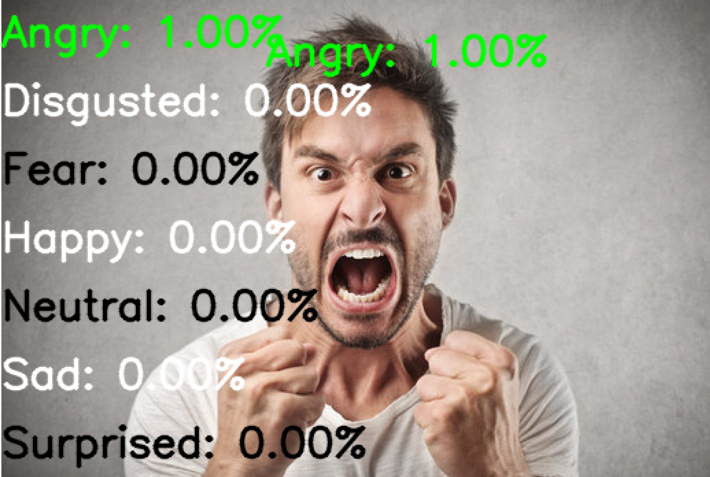

# Examination of Several Neural Networks for Facial Emotion Recognition
this project is a bachelor thesis in  **TU Bergakademie Freiberg**. in this project emotions will be recognized through the face in a image.

Happy coding :grin:

# Tools
* [Tesnorflow](https://www.tensorflow.org/)  
  * ``` pip install tensorflow ``` 
* [OpenCv](https://docs.opencv.org/3.4/index.html)
  * ``` pip install opencv-python ``` 
* [first dataset:  FER-2013](https://www.kaggle.com/datasets/msambare/fer2013?select=train)


# Run App
* help: `python3 main.py -h`

      -t TEST, --test TEST      test model
      -l TRAIN, --train TRAIN   train model

* to testing by webcam:  `python3 main.py -t testCam`
* to testing by image:  `python3 main.py -i "image_path"`
* to training: `python3 main.py -l train `
* tensorBoard: after training run following commands

      rm -rf ./logs/
      tensorboard --logdir logs/fit
  
* clean: ``` py3clean . ```

# Implementation
* just call [*saveImageFromCamera()*](Recognition/face/camera.py) in *main.py* from class *Camera*
* [Load dataset](Recognition/Emotion/help_functions.py)
  * **Train**: by calling *load_dataset("Recognition/archive/train/")* 
  * **Test**: by calling *load_dataset("Recognition/archive/test/")*

# Preprocessing
* to detect face and to build a black mask around it
  ```
    cd Recognition
    python3 preprocessing.py -f face
  ```

* to detect mouth & eyes and to build a black mask around them
  ```
    cd Recognition
    python3 preprocessing.py -em eyeMouth
  ```

# Screenshots
## APP
### without preprocessing:


### with detected the whole features in face:


### with detected just eyes and mouth of the face:


 with detected just eyes and mouth of the face and with less dataset than the orginal:


## result
* Angry:

* Fear:

* Disgusted:

* Neutral:

* Happy:

* Surptised:


    
# uninstall package
```
pip uninstall "package name"

```
